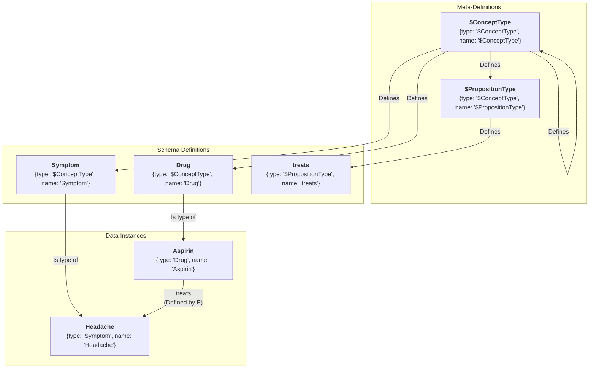
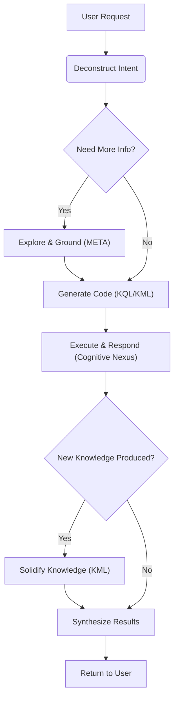

# 🧬 KIP (Knowledge Interaction Protocol) Specification (Release Candidate)

**[English](./SPECIFICATION.md) | [中文](./SPECIFICATION_CN.md)**

**Version History**:
| Version     | Date       | Change Log                                                                                                                                                                                                                                                                                                                                                                                                                                                                                                                                                                                                                                                                                                                                                  |
| ----------- | ---------- | ----------------------------------------------------------------------------------------------------------------------------------------------------------------------------------------------------------------------------------------------------------------------------------------------------------------------------------------------------------------------------------------------------------------------------------------------------------------------------------------------------------------------------------------------------------------------------------------------------------------------------------------------------------------------------------------------------------------------------------------------------------- |
| v1.0-draft1 | 2025-06-09 | Initial Draft                                                                                                                                                                                                                                                                                                                                                                                                                                                                                                                                                                                                                                                                                                                                               |
| v1.0-draft2 | 2025-06-15 | Optimized `UNION` clause                                                                                                                                                                                                                                                                                                                                                                                                                                                                                                                                                                                                                                                                                                                                    |
| v1.0-draft3 | 2025-06-18 | Refined terminology, simplified syntax, removed `SELECT` subqueries, added `META` clause, enhanced proposition link clauses                                                                                                                                                                                                                                                                                                                                                                                                                                                                                                                                                                                                                                 |
| v1.0-draft4 | 2025-06-19 | Simplified syntax, removed `COLLECT`, `AS`, `@`                                                                                                                                                                                                                                                                                                                                                                                                                                                                                                                                                                                                                                                                                                             |
| v1.0-draft5 | 2025-06-25 | Removed `ATTR` and `META`, introduced "Dot Notation"; added `(id: "<link_id>")`; optimized `DELETE` statement                                                                                                                                                                                                                                                                                                                                                                                                                                                                                                                                                                                                                                               |
| v1.0-draft6 | 2025-07-06 | Established naming conventions; introduced Bootstrapping Model: added "$ConceptType", "$PropositionType" meta-types and Domain type; added Genesis Capsule                                                                                                                                                                                                                                                                                                                                                                                                                                                                                                                                                                                                  |
| v1.0-draft7 | 2025-07-08 | Replaced `OFFSET` with `CURSOR` for pagination; added Knowledge Capsule for `Person` type                                                                                                                                                                                                                                                                                                                                                                                                                                                                                                                                                                                                                                                                   |
| v1.0-draft8 | 2025-07-17 | Optimized documentation; added `Event` type for episodic memory; added SystemInstructions.md; added FunctionDefinition.json                                                                                                                                                                                                                                                                                                                                                                                                                                                                                                                                                                                                                                 |
| v1.0-RC     | 2025-11-19 | v1.0 Release Candidate: Optimized documentation; added KIP Standard Error Codes                                                                                                                                                                                                                                                                                                                                                                                                                                                                                                                                                                                                                                                                             |
| v1.0-RC2    | 2025-12-31 | v1.0 Release Candidate 2: Optimized documentation; changed parameter placeholder prefix from `?` to `:`; added support for batch command execution                                                                                                                                                                                                                                                                                                                                                                                                                                                                                                                                                                                                          |
| v1.0-RC3    | 2026-01-09 | v1.0 Release Candidate 3: Optimized documentation; optimized instructions; optimized knowledge capsules                                                                                                                                                                                                                                                                                                                                                                                                                                                                                                                                                                                                                                                     |
| v1.0-RC4    | 2026-03-09 | v1.0 Release Candidate 4: Added `IN`, `IS_NULL`, `IS_NOT_NULL` FILTER operators; clarified UNION variable scope semantics; defined batch response structure; added temporal and UNION query examples                                                                                                                                                                                                                                                                                                                                                                                                                                                                                                                                                        |
| v1.0-RC5    | 2026-03-25 | v1.0 Release Candidate 5: Added `execute_kip_readonly` interface                                                                                                                                                                                                                                                                                                                                                                                                                                                                                                                                                                                                                                                                                            |
| v1.0-RC6    | 2026-04-25 | v1.0 Release Candidate 6: Aligned error code `KIP_2003` (`InvalidValueType`); specified implicit `GROUP BY` for aggregation; clarified path operator zero-hop semantics, `WITH METADATA` precedence, `DELETE CONCEPT` cascade, `KIP_3004` protected scope, `OPTIONAL` null projection, `expires_at` lifecycle, and batch KQL/KML error semantics                                                                                                                                                                                                                                                                                                                                                                                                            |
| v1.0-RC7    | 2026-06-04 | v1.0 Release Candidate 7: Added single-command `execute_kip` input and per-command batch parameters; clarified placeholder substitution as complete KIP value positions including `LIMIT` and `SEARCH`; documented JSON-compatible object literals with unquoted identifier keys; tightened schema naming, proposition uniqueness, and ID-based proposition update guidance; standardized examples on `belongs_to_class`; hardened Hippocampus Formation/Maintenance provenance with `created_at`, ID-based supersession, and maintenance log read-merge-write; added `recall_memory.context.user` as a legacy alias and aligned MCP/tool schemas                                                                                                           |
| v1.0-RC8    | 2026-06-10 | v1.0 Release Candidate 8: Clarified `ORDER BY` sort expressions (dot-notation paths and aggregation expressions, single sort key); defined whole-object dot access (`?var.attributes` / `?var.metadata`); defined aggregation `null` semantics (`COUNT` of unmatched `OPTIONAL` group is `0`); specified `KIP_3002` for match-only `{id:}` / `(id:)` targets; extended `KIP_3004` protected scope to the `Domain` type and `belongs_to_domain` definitions; declared `instance_schema` enforcement implementation-defined; allowed `CURSOR :param` placeholders; removed unregistered `created_by` predicate from instruction examples and aligned `$system` decay guidance with ID-based proposition updates                                               |
| v1.0-RC9    | 2026-06-11 | v1.0 Release Candidate 9: Added associative-recall and memory-metabolism primitives: predicate variables in proposition patterns (`(?s, ?p, ?o)`); multi-key `ORDER BY`; specified `SEARCH` retrieval modes (`MODE "keyword" \| "semantic" \| "hybrid"`, `THRESHOLD`, transient `_score`); new KML `UPDATE` statement (bulk pattern-matched mutation with `ADD` / `MUL` / `CLAMP` / `COALESCE` update expressions) and `MERGE CONCEPT ... INTO ...` statement (atomic entity consolidation); reserved engine-maintained `_` metadata namespace (`_version`, `_updated_at`; deliberately no read-tracking statistics); `EXPECT VERSION` optimistic concurrency with new `KIP_3005` error; added META `EXPORT` statement for knowledge-capsule round-tripping |

**KIP Implementations**:
- [Anda KIP SDK](https://github.com/ldclabs/anda-db/tree/main/rs/anda_kip): A Rust SDK for KIP-based sustainable AI knowledge memory systems.
- [Anda Cognitive Nexus](https://github.com/ldclabs/anda-db/tree/main/rs/anda_cognitive_nexus): A Rust implementation of KIP based on Anda DB.
- [Anda Cognitive Nexus Python](https://github.com/ldclabs/anda-db/tree/main/py/anda_cognitive_nexus_py): A Python binding for Anda Cognitive Nexus.
- [Anda Cognitive Nexus HTTP Server](https://github.com/ldclabs/anda-db/tree/main/rs/anda_cognitive_nexus_server): A Rust-based HTTP server that exposes KIP via a small JSON-RPC API (`GET /`, `POST /kip`).
- [Anda App](https://github.com/ldclabs/anda-app): An AI Agent client app based on KIP.

**About Us**:
[ICPanda](https://panda.fans/): ICPanda is a community-driven project that aims to build the foundational infrastructure and applications that empower AI agents to thrive as first-class citizens in the Web3 ecosystem.

## 0. Preface

Large Language Models (LLMs) have demonstrated remarkable capabilities in general reasoning and generation. However, their **"Stateless"** essence results in a lack of long-term memory, while their probability-based generation mechanism often leads to uncontrollable "hallucinations" and knowledge obsolescence.

Constructing a system that leverages the powerful reasoning capabilities of LLMs while ensuring persistence, accuracy, and traceability through structured data is the core challenge in current AI Agent architecture. **Neuro-Symbolic AI** is considered the critical path to solving this problem.

**KIP (Knowledge Interaction Protocol)** was born for this purpose.

KIP defines a standard interaction protocol aimed at bridging the gap between the **LLM (Probabilistic Reasoning Engine)** and the **Knowledge Graph (Deterministic Knowledge Base)**. It is not merely a database interface, but a set of **memory and cognitive operation primitives** designed specifically for intelligent agents.

Through KIP, we aim to achieve:

1.  **Memory Persistence**: Transforming an Agent's conversations, observations, and reasoning results into structured "Knowledge Capsules," enabling atomic storage and reuse of memory.
2.  **Knowledge Evolution**: Providing complete CRUD (Create, Read, Update, Delete) and metadata management mechanisms, empowering Agents with the ability to autonomously update their knowledge base and correct errors—true "learning."
3.  **Explainable Interaction**: Explicitly translating implicit thought processes into KIP instructions, making every answer traceable and every decision logically transparent.

This specification aims to provide an open, universal standard for developers, architects, and researchers to build the next generation of agents equipped with **trusted memory** and **continuous learning capabilities**.

## 1. Introduction & Design Philosophy

**KIP (Knowledge Interaction Protocol)** is a graph-oriented interaction protocol designed specifically for Large Language Models. By defining a standardized instruction set (KQL/KML) and JSON data schema, it regulates the communication method between an Agent and its external Long-term Memory.

The core objective of KIP is to establish a **unified Cognitive Nexus**, enabling AI Agents to manipulate complex knowledge networks as naturally and efficiently as they operate a file system.

**Design Philosophy:**

*   **Model-First**: The protocol syntax is optimized for Transformer architectures. It uses native JSON data structures, and the instruction logic aligns with natural language reasoning intuition, maximizing the reduction of syntax errors during LLM code generation.
*   **Intent-Driven**: Adopts a declarative syntax. The Agent only needs to describe "what knowledge is needed" or "what needs to be updated based on what fact," while the underlying graph traversal and transaction processing are encapsulated by the protocol implementation layer.
*   **Graph-Native & Self-Describing**: Based on a "Concept-Proposition" graph structure. Supports **Schema Bootstrapping**, meaning the type definitions (Schema) of data are stored within the graph itself. Agents can autonomously understand unknown knowledge structures by querying metadata.
*   **Atomicity & Idempotency**: All knowledge write operations (UPSERT) are designed as atomic transactions and possess idempotency. This ensures the consistency and stability of the knowledge base state under scenarios of network fluctuations or repetitive Agent reasoning.
*   **Verifiability**: Emphasizes "Provenance" and "Context." The protocol enforces Metadata binding, ensuring that every piece of knowledge can trace its source, confidence level, and generation time.

## 2. Core Definitions

### 2.1. Cognitive Nexus

A knowledge graph composed of **Concept Nodes** and **Proposition Links**, serving as the AI Agent's **unified memory brain**. It accommodates all levels of memory, from transient episodic events to persistent semantic knowledge, and implements memory **metabolism (consolidation and forgetting)** through autonomous background system processes.

### 2.2. Concept Node

*   **Definition**: An **entity** or **abstract concept** in the knowledge graph, serving as the basic unit of knowledge (the "Node" in the graph).
*   **Example**: A `Drug` node named "Aspirin", a `Symptom` node named "Headache".
*   **Composition**:
    *   `id`: String, a unique identifier used to uniquely locate the node in the graph.
    *   `type`: String, the type of the node. **Its value must be the name of a concept node of type `"$ConceptType"` already defined in the graph.** Follows `UpperCamelCase` naming convention.
    *   `name`: String, the name of the node. The combination of `type` + `name` also uniquely locates a node in the graph.
    *   `attributes`: Object, attributes of the node, describing the intrinsic characteristics of the concept.
    *   `metadata`: Object, metadata of the node, describing the source, trustworthiness, and other information about the concept.

### 2.3. Proposition Link

*   **Definition**: An **instantiated proposition**, stating a **Fact** in the form of a `(Subject, Predicate, Object)` triple. It serves as a **Link** in the graph, connecting two concept nodes or implementing higher-order connections.
*   **Example**: A proposition link stating the fact "(Aspirin) - [treats] -> (Headache)".
*   **Composition**:
    *   `id`: String, a unique identifier used to uniquely locate the link in the graph.
    *   `subject`: String, the initiator of the relationship, the ID of a concept node or another proposition link.
    *   `predicate`: String, defines the type of **Relation** between the subject and object. **Its value must be the name of a concept node of type `"$PropositionType"` already defined in the graph.** Follows `snake_case` naming convention.
    *   `object`: String, the receiver of the relationship, the ID of a concept node or another proposition link.
    *   `attributes`: Object, attributes of the proposition, describing intrinsic characteristics of the relationship.
    *   `metadata`: Object, metadata of the proposition, describing the source, trustworthiness, and other information about the proposition.

### 2.4. Knowledge Capsule

An idempotent knowledge update unit. It is a collection of **Concept Nodes** and **Proposition Links**, used to solve problems related to the encapsulation, distribution, and reuse of high-quality knowledge.

### 2.5. Cognitive Primer

A highly structured, high-information-density JSON object designed specifically for LLMs. It contains a global summary and domain map of the Cognitive Nexus, helping the LLM quickly understand and utilize the memory system.

### 2.6. Attributes & Metadata

*   **Attributes**: Key-value pairs describing the intrinsic characteristics of a **Concept** or **Fact**. They are part of the knowledge memory itself.
*   **Metadata**: Key-value pairs describing the **source, trustworthiness, and context** of the knowledge. It does not change the content of the knowledge itself but describes "knowledge about the knowledge." (See Appendix 1 for metadata field design).
*   **Reserved System Metadata**: Metadata keys beginning with an underscore (`_`) form a **reserved namespace maintained by the engine** (e.g., `_version`, `_updated_at`). They are readable via dot notation like any other metadata, but **read-only to KML** — attempting to set or delete a `_`-prefixed key returns `KIP_2002`. (See §2.11 and Appendix 1, A1.4).

### 2.7. Value Types

KIP adopts a **JSON-compatible** data model. Stored values use JSON types, while KIP command text permits a small shorthand for LLM ergonomics: object keys may be quoted JSON strings or unquoted identifiers, and parameter placeholders such as `:name` are substituted before execution. This preserves unambiguous data exchange while keeping generated commands compact.

*   **Primitive Types**: `string`, `number`, `boolean`, `null`.
*   **Complex Types**: `Array`, `Object`.
*   **Usage Limitation**: While `Array` and `Object` can be stored as values for attributes or metadata, KQL's `FILTER` clauses operate on primitive comparison values. Array literals are used by helper functions such as `IN(...)`, not for deep structural comparison.

### 2.8. Identifiers & Naming Conventions

Identifiers are the basis for naming variables, types, predicates, attributes, and metadata keys in KIP. To ensure protocol clarity, readability, and consistency, KIP mandates strict rules for identifier syntax and naming styles.

#### 2.8.1. Identifier Syntax

A valid KIP identifier **must** start with a letter (`a-z`, `A-Z`) or an underscore (`_`), followed by any number of letters, digits (`0-9`), or underscores.
This rule applies to all types of naming, but meta-types use the `$` prefix as a special marker, and variables use the `?` prefix as a grammatical marker.
When executing commands via `execute_kip`, the command text may also contain parameter placeholders prefixed with `:` (e.g., `:name`, `:limit`) for safe substitution from `execute_kip.parameters`.

#### 2.8.2. Naming Conventions

In addition to basic syntax rules, KIP **requires** these naming conventions for schema-level names and variables, and recommends the same style for all attribute and metadata keys to enhance readability and code self-explanatoriness:

*   **Concept Node Types**: Use **UpperCamelCase**.
    *   **Examples**: `Drug`, `Symptom`, `MedicalDevice`, `ClinicalTrial`.
    *   **Meta-Types**: `$ConceptType`, `$PropositionType`. Those starting with `$` are system-reserved meta-types.
*   **Proposition Link Predicates**: Use **snake_case**.
    *   **Examples**: `treats`, `has_side_effect`, `is_subclass_of`, `belongs_to_domain`.
*   **Attribute & Metadata Keys**: Use **snake_case**.
    *   **Examples**: `molecular_formula`, `risk_level`, `observed_at`.
*   **Variables**: **Must** use `?` as a prefix, followed by **snake_case**.
    *   **Examples**: `?drug`, `?side_effect`, `?clinical_trial`.

> **Note**: The KIP protocol is case-sensitive. Schema-level Concept Types must use `UpperCamelCase` (e.g., `Drug`) and Proposition Predicates must use `snake_case` (e.g., `treats`). Incorrect capitalization (e.g., using `drug` instead of `Drug`) will result in a `KIP_2001` error.

### 2.9. Knowledge Bootstrapping & Meta-Definition

One of KIP's core designs is the **self-describing capability of the knowledge graph**. The schema of the Cognitive Nexus—that is, all legal concept types and proposition types—is itself part of the graph, defined by concept nodes. This allows the entire knowledge system to bootstrap itself and be understood and extended without external definitions.

#### 2.9.1. Meta-Types

The system pre-defines only two special meta-types starting with `$`:

*   **`"$ConceptType"`**: Used to define the type of **Concept Node Types**. If a node's `type` is `"$ConceptType"`, it means this node itself defines a "Type".
    *   **Example**: The node `{type: "$ConceptType", name: "Drug"}` defines `Drug` as a legal concept type. Only after this can we create nodes like `{type: "Drug", name: "Aspirin"}`.
*   **`"$PropositionType"`**: Used to define the type of **Proposition Link Predicates**. If a node's `type` is `"$PropositionType"`, it means this node itself defines a "Relation" or "Predicate".
    *   **Example**: The node `{type: "$PropositionType", name: "treats"}` defines `treats` as a legal predicate. Only after this can we create propositions like `(?aspirin, "treats", ?headache)`.

**Important (Must Follow)**:
*   **Define Before Use**: Any "Concept Node Type" and "Proposition Link Predicate" must be explicitly registered via meta-types before being instantiated or referenced in KQL/KML.
*   **Constraint Enforcement**: A type's `instance_schema` is best-practice guidance by default — instances SHOULD provide attributes marked `is_required: true` and MAY carry additional attributes. Implementations MAY enforce required attributes and value types strictly; where enforced, violations return `KIP_2002` (missing required attribute) or `KIP_2003` (wrong value type).
*   **Sustainable Schema Evolution**: The `instance_schema`, `description`, etc., of defined types can be continuously improved and iterated; this includes the definitions of `"$ConceptType"` and `"$PropositionType"` themselves. Evolution should strive to maintain backward compatibility to avoid breaking existing instances and propositions.

#### 2.9.2. The Genesis

These two meta-types are themselves defined by concept nodes, forming a self-consistent loop:

*   The definition node for `"$ConceptType"` is: `{type: "$ConceptType", name: "$ConceptType"}`
*   The definition node for `"$PropositionType"` is: `{type: "$ConceptType", name: "$PropositionType"}`

This means `"$ConceptType"` is a kind of `"$ConceptType"`, constituting the logical cornerstone of the entire type system.



#### 2.9.3. Cognitive Domain

To effectively organize and isolate knowledge, KIP introduces the concept of `Domain`:

*   **`Domain`**: It is itself a concept type, defined via `{type: "$ConceptType", name: "Domain"}`.
*   **Domain Node**: For example, `{type: "Domain", name: "Medical"}` creates a cognitive domain named "Medical".
*   **Membership**: Concept nodes may not belong to any domain upon creation to maintain system flexibility and authenticity. In subsequent reasoning, they should be assigned to corresponding domains via `belongs_to_domain` proposition links, ensuring knowledge can be efficiently utilized by the LLM.

### 2.10. Data Consistency & Conflict Resolution Principles

*   **Attribute Update Strategy**: In `UPSERT` operations, `SET ATTRIBUTES` adopts a **Shallow Merge Strategy**: only Keys present in the command are updated (overwritten), and Keys not present remain unchanged. If a Key's value is an `Array` or `Object`, the update is still an **overwrite at that Key** (no recursive deep merge). Therefore, when updating an array attribute, the Agent must provide the full array content.
*   **Metadata Precedence**: When `WITH METADATA` is specified at multiple levels of an `UPSERT` block (the outer `UPSERT` block and an inner `CONCEPT`/`PROPOSITION` block, or on a single proposition inside `SET PROPOSITIONS`), the **inner block overrides the outer block via key-by-key shallow merge**. Keys absent in the inner block are inherited from the outer block; keys present in the inner block (including those whose value is `null`) take precedence.
*   **Proposition Uniqueness**: KIP enforces a **(Subject, Predicate, Object) Uniqueness Constraint**. Only one proposition with the same predicate can exist for the same subject and object IDs, whether those endpoints are concept nodes or proposition links. Duplicate `UPSERT` operations will be treated as updates to the metadata or attributes of the existing proposition.
*   **Memory Lifecycle (`expires_at`)**: A non-null `metadata.expires_at` declares **when** a piece of knowledge becomes a candidate for forgetting. It does **not** automatically filter the knowledge out of query results — expired knowledge remains queryable until a background system process (typically run by `$system` during sleep cycles) physically removes or archives it. Agents that need to ignore expired memories must add an explicit `FILTER(IS_NULL(?x.metadata.expires_at) || ?x.metadata.expires_at > <now>)`.

### 2.11. System-Maintained Metadata & Optimistic Concurrency

A memory brain shared by multiple writers (e.g., several business agents feeding one Cognitive Nexus, or Formation running concurrently with a sleep cycle) needs two guarantees that author-asserted metadata cannot provide: **trustworthy bookkeeping** (what actually changed, and when) and **lost-update protection** for read-modify-write flows. KIP provides both through the reserved `_` metadata namespace.

#### 2.11.1. Reserved `_` Metadata Fields

Metadata keys beginning with `_` are maintained exclusively by the engine. KML statements cannot set or delete them (`KIP_2002`); KQL reads them like ordinary metadata (`?x.metadata._version`). The protocol defines:

| Field          | Type   | Engine Support | Semantics                                                                                                                                                                                                                      |
| :------------- | :----- | :------------- | :----------------------------------------------------------------------------------------------------------------------------------------------------------------------------------------------------------------------------- |
| `_version`     | Number | **REQUIRED**   | Monotonic mutation counter for the element. Starts at `1` on creation and increments by at least 1 on every successful mutation of the element (attributes, metadata, or — for propositions — endpoint repointing by `MERGE`). |
| `_updated_at`  | String | RECOMMENDED    | ISO 8601 timestamp of the element's last mutation, set by the engine. Unlike author-asserted `created_at` / `observed_at`, this is engine truth.                                                                               |
| `_score`       | Number | OPTIONAL       | **Transient, never persisted.** Normalized relevance score `[0, 1]` attached to elements returned by `SEARCH` (see §5.2). Absent outside search results.                                                                       |
| `_merged_from` | Array  | OPTIONAL       | Provenance trail of `MERGE` operations on the surviving node: `"<Type>:<name>"` entries appended by the engine for each merged-in source (see §4.4).                                                                           |

Engines MAY define additional `_`-prefixed fields; agents MUST treat unknown `_` fields as read-only and MUST NOT rely on their presence.

The protocol deliberately defines **no access statistics** (e.g., last-recall timestamps or recall counters): maintaining them would turn every read into a write — hostile to caching, read replicas, and idempotent retries — and recall frequency is a poor proxy for importance (a long-unrecalled commitment or identity fact is no less true or vital). Memory-metabolism processes should weigh author-maintained signals (`evidence_count`, `last_observed`, `salience_score`, `expires_at`) instead.

#### 2.11.2. `EXPECT VERSION` — Conditional Writes

Array and object values are overwritten whole at their key (§2.10), so updating them safely requires read-modify-write. Between the read and the write, a concurrent writer may have changed the element — silently losing one of the two updates. `UPSERT` blocks therefore accept an optional guard, placed immediately after the identity clause:

```prolog
CONCEPT ?self {
  {type: "Person", name: "$self"}
  EXPECT VERSION :v
  SET ATTRIBUTES { behavior_preferences: :merged_preferences }
}
```

*   **Semantics**: The block executes only if the matched element's current `_version` equals the expected value. On mismatch the **entire `UPSERT` statement aborts atomically** with `KIP_3005` (`VersionConflict`); no partial writes occur.
*   **`EXPECT VERSION 0`** asserts the element does **not yet exist** — a create-only write. If the element already exists, the statement fails with `KIP_3005`.
*   **Recovery**: re-read the element (obtaining the fresh `_version`), re-apply the merge in memory, and retry. This loop is the standard pattern for safe concurrent evolution of `$self` attributes, logs, and other array/object values.
*   The guard accepts a parameter placeholder (`EXPECT VERSION :v`). It is valid in `CONCEPT` and `PROPOSITION` blocks of `UPSERT`; it is **not** valid in bulk `UPDATE` / `DELETE` statements, whose pattern-matched targets should be guarded by their `WHERE` conditions instead.
*   `EXPECT VERSION` is optional everywhere. Writes without the guard keep today's last-writer-wins shallow-merge semantics.

## 3. KIP-KQL Instruction Set: Knowledge Query Language

KQL is the part of KIP responsible for knowledge retrieval and reasoning.

### 3.1. Query Structure

```prolog
FIND( ... )
WHERE {
  ...
}
ORDER BY ...
LIMIT N
CURSOR "<token>"
```

### 3.2. Dot Notation

**Dot notation is the preferred method for accessing internal data of concept nodes and proposition links in KIP.** It provides a unified, intuitive, and powerful mechanism to use data directly in `FIND`, `FILTER`, and `ORDER BY` clauses.

Internal data of a node or link bound to variable `?var` can be accessed via the following paths:

*   **Access Top-level Fields**:
    *   `?var.id`, `?var.type`, `?var.name`: For concept nodes.
    *   `?var.id`, `?var.subject`, `?var.predicate`, `?var.object`: For proposition links.
*   **Access Attributes**:
    *   `?var.attributes.<attribute_name>`
*   **Access Metadata**:
    *   `?var.metadata.<metadata_key>`
*   **Access Whole Objects**:
    *   `?var.attributes`, `?var.metadata`: Return the complete attributes/metadata object. Useful in `FIND` projections (e.g., `FIND(?self.attributes)`, `FIND(?link.metadata)`); whole-object values are not comparable in `FILTER` (see §2.7).

**Examples**:
```prolog
// Find drug names and their risk levels
FIND(?drug.name, ?drug.attributes.risk_level)
WHERE {
  ?drug {type: "Drug"}
}

// Filter propositions with confidence higher than 0.9
FIND(?link)
WHERE {
  ?link ({type: "Drug", name: "Aspirin"}, "treats", {type: "Symptom", name: "Headache"})
  FILTER(?link.metadata.confidence > 0.9)
}
```

### 3.3. `FIND` Clause

**Function**: Declares the final output of the query.

**Syntax**: `FIND( ... )`

*   **Multi-variable Return**: Can specify one or more variables, e.g., `FIND(?drug, ?symptom)`.
*   **Aggregation Return**: Can use aggregation functions on variables, e.g., `FIND(?var1, ?agg_func(?var2))`.
    *   **Aggregation Functions**: `COUNT(?var)`, `COUNT(DISTINCT ?var)`, `SUM(?var)`, `AVG(?var)`, `MIN(?var)`, `MAX(?var)`.
    *   **Implicit Grouping**: When `FIND` mixes plain variables (or dot-notation expressions) with aggregation functions, all non-aggregated expressions form an **implicit `GROUP BY`** key. Each distinct combination of grouping values produces one result row, and aggregation functions are computed within each group. If `FIND` contains *only* aggregation functions, the entire result set is treated as a single group.
    *   **Null Handling**: Aggregation functions ignore `null` (unbound) values. In particular, `COUNT(?var)` over a group whose only rows carry a `null` binding (e.g., an `OPTIONAL` miss) returns `0`.

### 3.4. `WHERE` Clause

**Function**: Contains a series of graph pattern matching and filtering clauses. All clauses are logically **AND**-ed by default.

#### 3.4.1. Concept Node Clause

**Function**: Matches concept nodes and binds them to variables. Uses `{...}` syntax.

**Syntax**:
*   `?node_var {id: "<node_id>"}`: Matches a unique concept node by unique ID.
*   `?node_var {type: "<Type>", name: "<name>"}`: Matches a unique concept node by type and name.
*   `?nodes_var {type: "<Type>"}`, `?nodes_var {name: "<name>"}`: Matches a batch of concept nodes by type or name.

`?node_var` binds the matched concept node to a variable for subsequent operations. However, when a concept node clause is used directly as the subject or object of a proposition link clause, the variable name should be omitted.

**Examples**:

```prolog
// Match all nodes of type Drug
?drug {type: "Drug"}

// Match the drug named "Aspirin"
?aspirin {type: "Drug", name: "Aspirin"}

// Match node by specific ID
?headache {id: "C:123"}
```

#### 3.4.2. Proposition Link Clause

**Function**: Matches proposition links and binds them to variables. Uses `(...)` syntax.

**Syntax**:
*   `?link_var (id: "<link_id>")`: Matches a unique proposition link by unique ID.
*   `?link_var (?subject, "<predicate>", ?object)`: Matches a batch of proposition links via structural pattern. The subject or object can be a variable of a concept node or another proposition link, or a clause without a variable name.
*   `?link_var (?subject, ?predicate, ?object)`: The predicate position may itself be a **variable**, which binds to the predicate **name** (a string) of each matched link. This is the primitive for **associative recall** — exploring what surrounds a node without knowing the relation in advance.
*   The predicate part supports path operators (literal predicates only):
    *   `"<predicate>"{m,n}`: Matches predicate m to n hops, e.g., `"follows"{1,5}`, `"follows"{1,}`, `"follows"{5}`. When `m == 0`, a **zero-hop reflexive match** is included where the subject and object are bound to the *same* node (no edge traversal); the predicate's transitive semantics still govern higher hops.
    *   `"<predicate1>" | "<predicate2>" | ...`: Matches a set of literal predicates, e.g., `"follows" | "connects" | "links"`.

`?link_var` is optional; it binds the matched proposition link to a variable for subsequent operations.

**Predicate variable rules**:
*   A predicate variable binds a `string` (the predicate name). It can be projected in `FIND` and tested in `FILTER` (comparison, `IN`, string functions), and it unifies across clauses like any other variable.
*   Predicate variables **cannot** carry path quantifiers or alternatives (`?p{1,3}` and `?p | "treats"` are invalid → `KIP_1001`).
*   **Bounded exploration required**: in a clause with a predicate variable, at least one endpoint SHOULD be constrained (by ID, by `type`/`name`, or by a previously bound variable). Engines MAY reject a fully unconstrained pattern `(?s, ?p, ?o)` with `KIP_4002`; always pair exploration queries with `LIMIT`.

**Examples**:

```prolog
// Find all drugs that treat headaches
(?drug, "treats", ?headache)

// Bind a proposition with known ID to a variable
?specific_fact (id: "P:12345:treats")

// Higher-order proposition: Object is another proposition
(?user, "stated", (?drug, "treats", ?symptom))
```

```prolog
// Find parent concepts within 5 hops
(?concept, "is_subclass_of"{0,5}, ?parent_concept)
```

```prolog
// Associative recall: everything directly connected to Aspirin, with the relation name
FIND(?pred, ?neighbor)
WHERE {
  ?link ({type: "Drug", name: "Aspirin"}, ?pred, ?neighbor)
  FILTER(?pred != "belongs_to_domain")
}
LIMIT 50
```

#### 3.4.3. Filter Clause (`FILTER`)

**Function**: Applies complex filtering conditions to bound variables. **Dot notation is strongly recommended.**

**Syntax**: `FILTER(boolean_expression)`

**Functions & Operators**:
*   **Comparison**: `==`, `!=`, `<`, `>`, `<=`, `>=`
*   **Logical**: `&&` (AND), `||` (OR), `!` (NOT)
*   **Membership**: `IN(?expr, [<value1>, <value2>, ...])` — Returns `true` if `?expr` matches any value in the list.
*   **Null Check**: `IS_NULL(?expr)`, `IS_NOT_NULL(?expr)` — Tests whether a value is `null` (absent or explicitly null). Useful for checking attribute/metadata existence.
*   **String**: `CONTAINS(?str, "sub")`, `STARTS_WITH(?str, "prefix")`, `ENDS_WITH(?str, "suffix")`, `REGEX(?str, "pattern")`

**Examples**:
```prolog
// Filter drugs with risk level less than 3 AND name containing "acid"
FILTER(?drug.attributes.risk_level < 3 && CONTAINS(?drug.name, "acid"))
```

```prolog
// Filter events by class membership
FILTER(IN(?event.attributes.event_class, ["Conversation", "SelfReflection"]))
```

```prolog
// Find concepts that have an expiration date set
FILTER(IS_NOT_NULL(?node.metadata.expires_at))
```

```prolog
// Find recent events (temporal query pattern)
FILTER(?event.attributes.start_time > "2025-01-01T00:00:00Z")
```

#### 3.4.4. Negation Clause (`NOT`)

**Function**: Excludes solutions that satisfy a specific pattern.

**Syntax**: `NOT { ... }`

**Examples**:

```prolog
// Exclude all drugs belonging to the NSAID class
NOT {
  ?nsaid_class {name: "NSAID"}
  (?drug, "belongs_to_class", ?nsaid_class)
}
```

Simpler version:
```prolog
// Exclude all drugs belonging to the NSAID class
NOT {
  (?drug, "belongs_to_class", {name: "NSAID"})
}
```

#### 3.4.5. Optional Clause (`OPTIONAL`)

**Function**: Attempts to match optional patterns, similar to SQL `LEFT JOIN`.

**Syntax**: `OPTIONAL { ... }`

**Examples**:

```prolog
// Find all drugs, and (if available) also find their side effects
?drug {type: "Drug"}

OPTIONAL {
  (?drug, "has_side_effect", ?side_effect)
}
```

#### 3.4.6. Union Clause (`UNION`)

**Function**: Combines results from multiple patterns, implementing logical **OR**.

**Syntax**: `UNION { ... }`

**Examples**:

```prolog
// Find drugs that treat "Headache" OR "Fever"

(?drug, "treats", {name: "Headache"})

UNION {
  (?drug, "treats", {name: "Fever"})
}
```

#### 3.4.7. Variable Scope Details: NOT, OPTIONAL, UNION

To ensure KQL queries are unambiguous and predictable, understanding how different graph pattern clauses in `WHERE` handle variable scope is crucial. The core concepts are **Binding** (assigning a value to a variable) and **Visibility** (whether a binding is available in other parts of the query).

**External Variables** refer to variables already bound outside a specific clause (like `NOT`). **Internal Variables** refer to variables bound for the first time inside a specific clause.

##### 3.4.7.1. `NOT` Clause: Pure Filter

The design philosophy of `NOT` is **"Exclude solutions that make the internal pattern valid."** It is a pure filter with the following scope rules:

*   **External Variable Visibility**: Inside `NOT`, all external variables bound before it are **visible**. It uses these bindings to attempt matching its internal pattern.
*   **Internal Variable Invisibility**: Any new variables bound inside `NOT` (internal variables) have their scope **strictly limited to within the `NOT` clause**.

**Execution Flow Example**: Find all non-NSAID drugs.

```prolog
FIND(?drug.name)
WHERE {
  ?drug {type: "Drug"} // ?drug is an external variable

  NOT {
    // Binding of ?drug is visible here
    // ?nsaid_class is an internal variable, scope limited to here
    ?nsaid_class {name: "NSAID"}
    (?drug, "belongs_to_class", ?nsaid_class)
  }
}
```
1. Engine finds a solution `?drug -> "Aspirin"`.
2. Engine enters `NOT` clause with this binding, attempts to match `("Aspirin", "belongs_to_class", ...)`.
3. If matching succeeds (Aspirin is NSAID), the `NOT` clause fails, and `?drug -> "Aspirin"` is **discarded**.
4. If matching fails (e.g., `?drug -> "Vitamin C"`), the `NOT` clause succeeds, and the solution is **kept**.
5. In any case, `?nsaid_class` is not visible outside `NOT`.

##### 3.4.7.2. `OPTIONAL` Clause: Left Join

The design philosophy of `OPTIONAL` is **"Attempt to match optional patterns; if successful, keep new bindings; if failed, keep original solution but new variables are null,"** similar to SQL `LEFT JOIN`.

*   **External Variable Visibility**: Inside `OPTIONAL`, all external variables bound before it are **visible**.
*   **Internal Variable Conditional Visibility**: New variables bound inside `OPTIONAL` (internal variables) have their scope **extended** outside the `OPTIONAL` clause.

**Execution Flow Example**: Find drugs and their known side effects.
```prolog
FIND(?drug.name, ?side_effect.name)
WHERE {
  ?drug {type: "Drug"} // ?drug is external variable

  OPTIONAL {
    // Binding of ?drug is visible
    // ?side_effect is internal variable, scope extends to outside
    (?drug, "has_side_effect", ?side_effect)
  }
}
```
1. Engine finds `?drug -> "Aspirin"`.
2. Enters `OPTIONAL`, attempts to match `("Aspirin", "has_side_effect", ?side_effect)`.
3. **Case A (Match Success)**: Finds "Stomach Upset". Final solution: `?drug -> "Aspirin", ?side_effect -> "Stomach Upset"`.
4. **Case B (Match Failure)**: For `?drug -> "Vitamin C"`, no match inside `OPTIONAL`. Final solution: `?drug -> "Vitamin C", ?side_effect -> null`.
5. In both cases, `?side_effect` is visible outside `OPTIONAL`. **Dot-notation projection on an unbound `OPTIONAL` variable** (e.g., `?side_effect.name`, `?side_effect.attributes.severity`) yields `null` — and `IS_NULL(?side_effect)` evaluates to `true` — so downstream `FILTER`s and `FIND` projections behave predictably.

##### 3.4.7.3. `UNION` Clause: Independent Execution, Merged Results

The design philosophy of `UNION` is **"Implement logical 'OR' for multiple independent query paths and merge the result sets."** The `UNION` clause is parallel to the block preceding it.

*   **External Variable Invisibility**: Inside `UNION`, external variables bound before it are **not visible**. It is a **completely independent scope**.
*   **Internal Variable Conditional Visibility**: New variables bound inside `UNION` (internal variables) have their scope **extended** outside the `UNION` clause.
*   **Same-Named Variables**: If the main block and `UNION` block each bind a variable with the **same name** (e.g., both use `?drug`), they are treated as **independent bindings**. The final result set is the **row-wise union** of both blocks, with variables not present in a given branch set to `null`.

**Execution Flow Example 1**: Find items via two completely independent paths.
```prolog
FIND(?drug.name, ?product.name)
WHERE {
  // Main pattern block
  ?drug {type: "Drug"}
  (?drug, "treats", {name: "Headache"})

  UNION {
    // Alternative pattern block (independent scope)
    ?product {type: "Product"}
    (?product, "manufactured_by", {name: "Bayer"})
  }
}
```
1. **Execute Main Block**: Finds `?drug -> "Ibuprofen"`.
2. **Execute `UNION` Block**: Independently finds `?product -> "Aspirin"`.
3. **Merge Results**:
    * Solution 1: `?drug -> "Ibuprofen", ?product -> null` (from Main)
    * Solution 2: `?drug -> null, ?product -> "Aspirin"` (from `UNION`)
4. Both `?drug` and `?product` are visible in the `FIND` clause.

**Execution Flow Example 2**: Logical OR with same variable name (common pattern).
```prolog
FIND(?drug.name)
WHERE {
  // Drugs that treat Headache
  ?drug {type: "Drug"}
  (?drug, "treats", {name: "Headache"})

  UNION {
    // OR drugs that treat Fever (independent scope, fresh ?drug binding)
    ?drug {type: "Drug"}
    (?drug, "treats", {name: "Fever"})
  }
}
```
1. Main block finds `?drug -> "Ibuprofen"`, `?drug -> "Acetaminophen"`.
2. `UNION` block independently finds `?drug -> "Ibuprofen"`, `?drug -> "Aspirin"`.
3. Merged result (deduplicated): `["Ibuprofen", "Acetaminophen", "Aspirin"]`.

### 3.5. Solution Modifiers

These clauses process the result set after the `WHERE` logic execution is complete.

*   `ORDER BY <expr> [ASC|DESC] [, <expr> [ASC|DESC]]...`: Sorts results by **one or more comma-separated sort keys**, evaluated left to right; each key defaults to `ASC` (Ascending). Each expression may be a bound variable (`?var`), a dot-notation path (`?var.attributes.<key>`), or an aggregation expression that also appears in `FIND` (e.g., `ORDER BY COUNT(?n) ASC` together with implicit grouping). **`null` values always sort last**, regardless of direction — so ranking by an optional signal (e.g., `salience_score`) naturally pushes unscored rows to the end.
    *   Example: `ORDER BY ?event.attributes.salience_score DESC, ?event.attributes.start_time DESC` — most memorable first, recency as the tie-breaker.
*   `LIMIT N`: Limits the number of returned results. Accepts a parameter placeholder (`LIMIT :limit`).
*   `CURSOR "<token>"`: Specifies a token as a cursor position for pagination. Accepts a parameter placeholder (`CURSOR :cursor`).

### 3.6. Comprehensive Query Examples

**Example 1**: Find all non-NSAID drugs that treat 'Headache', with a risk level lower than 4, sort by risk level ascending, and return drug name and risk level.

```prolog
FIND(
  ?drug.name,
  ?drug.attributes.risk_level
)
WHERE {
  ?drug {type: "Drug"}
  ?headache {name: "Headache"}

  (?drug, "treats", ?headache)

  NOT {
    (?drug, "belongs_to_class", {name: "NSAID"})
  }

  FILTER(?drug.attributes.risk_level < 4)
}
ORDER BY ?drug.attributes.risk_level ASC
LIMIT 20
```

**Example 2**: List all NSAID drugs and (if they exist) their known side effects and sources.

```prolog
FIND(
  ?drug.name,
  ?side_effect.name,
  ?link.metadata.source
)
WHERE {
  (?drug, "belongs_to_class", {name: "NSAID"})

  OPTIONAL {
    ?link (?drug, "has_side_effect", ?side_effect)
  }
}
```

**Example 3 (Higher-Order Proposition Deconstruction)**: Find the confidence level of the fact "Aspirin treats Headache" as stated by user "John Doe".

```prolog
FIND(?statement.metadata.confidence)
WHERE {
  // Match the fact: (Drug)-[treats]->(Symptom)
  ?fact (
    {type: "Drug", name: "Aspirin"},
    "treats",
    {type: "Symptom", name: "Headache"}
  )

  // Match the higher-order proposition: (John Doe)-[stated]->(Fact)
  ?statement ({type: "Person", name: "John Doe"}, "stated", ?fact)
}
```

**Example 4 (Temporal & Memory Query)**: Find recent conversation events involving a specific person, with their associated key concepts.

```prolog
FIND(?event, ?concept)
WHERE {
  ?event {type: "Event"}
  FILTER(?event.attributes.event_class == "Conversation")
  FILTER(?event.attributes.start_time > "2025-06-01T00:00:00Z")
  FILTER(IS_NOT_NULL(?event.attributes.participants))

  OPTIONAL {
    (?event, "mentions", ?concept)
  }
}
ORDER BY ?event.attributes.start_time DESC
LIMIT 20
```

**Example 5 (Associative Recall & Memory Ranking)**: Starting from a person, explore every relation around them (without knowing the predicates in advance), excluding organizational links, ranked by the strength of each memory.

```prolog
FIND(?pred, ?neighbor, ?link.metadata.confidence)
WHERE {
  ?person {type: "Person", name: "Alice"}
  ?link (?person, ?pred, ?neighbor)
  FILTER(?pred != "belongs_to_domain")
}
ORDER BY ?link.metadata.confidence DESC, ?link.metadata.created_at DESC
LIMIT 50
```

## 4. KIP-KML Instruction Set: Knowledge Manipulation Language

KML is the part of KIP responsible for knowledge evolution, serving as the core tool for Agent learning. It comprises four statements: `UPSERT` (identity-addressed create-or-update), `UPDATE` (pattern-matched bulk mutation), `MERGE` (atomic entity consolidation), and `DELETE` (targeted removal).

### 4.1. `UPSERT` Statement

**Function**: Creates or updates knowledge, carrying "Knowledge Capsules." Operations must guarantee **Idempotency**, meaning repeating the same instruction yields the exact same result as executing it once, without creating duplicate data or unexpected side effects.

**Syntax**:

```prolog
UPSERT {
  CONCEPT ?local_handle {
    {type: "<Type>", name: "<name>"} // Or: {id: "<id>"}
    EXPECT VERSION <n> // Optional optimistic-concurrency guard (see §2.11.2)
    SET ATTRIBUTES { <key>: <value>, ... }
    SET PROPOSITIONS {
      ("<predicate>", { <existing_concept> })
      ("<predicate>", ( <existing_proposition> ))
      ("<predicate>", ?other_handle) WITH METADATA { <key>: <value>, ... }
      ...
    }
  }
  WITH METADATA { <key>: <value>, ... }

  PROPOSITION ?local_prop { // ?local_prop is optional
    (?subject, "<predicate>", ?object) // Or: (id: "<id>")
    EXPECT VERSION <n> // Optional optimistic-concurrency guard (see §2.11.2)
    SET ATTRIBUTES { <key>: <value>, ... }
  }
  WITH METADATA { <key>: <value>, ... }

  ...
}
WITH METADATA { <key>: <value>, ... }
```

#### Key Components:

*   **`UPSERT` Block**: Container for the entire operation.
*   **`CONCEPT` Block**: Defines a concept node.
    *   `?local_handle`: A local handle (or anchor) starting with `?`, used to reference this new concept within the transaction. It is valid only within this `UPSERT` block.
    *   `{type: "<Type>", name: "<name>"}`: Matches or creates a concept node; `{id: "<id>"}` only matches an existing node (returns `KIP_3002` if no such node exists).
    *   `EXPECT VERSION <n>` (optional): Guards the block against concurrent modification. The block proceeds only if the matched element's `_version` equals `<n>`; `EXPECT VERSION 0` asserts the element does not exist yet (create-only). On mismatch, the entire `UPSERT` aborts with `KIP_3005` (see §2.11.2).
    *   `SET ATTRIBUTES { ... }`: Sets or updates (shallow merge) the node's attributes.
    *   `SET PROPOSITIONS { ... }`: Defines or updates proposition links initiated by this concept node. The behavior of `SET PROPOSITIONS` is **additive**, not replacing. It checks all outgoing relations of the concept: 1. If an identical proposition (same subject, predicate, object) does not exist, creates it; 2. If it exists, only updates or adds metadata specified in `WITH METADATA`. If a proposition requires complex intrinsic attributes, use an independent `PROPOSITION` block and reference via `?handle`.
        *   `("<predicate>", ?local_handle)`: Links to another concept or proposition defined in this capsule.
        *   `("<predicate>", {type: "<Type>", name: "<name>"})`, `("<predicate>", {id: "<id>"})`: Links to an existing concept in the graph; if the target does not exist, returns `KIP_3002`.
        *   `("<predicate>", (id: "<id>"))`: Links to an existing proposition by ID; if the target does not exist, returns `KIP_3002`.
        *   `("<predicate>", (?subject, "<predicate>", ?object))`: Links to an existing proposition by structural identity; if the target does not exist, returns `KIP_3002`.
*   **`PROPOSITION` Block**: Defines an independent proposition link, usually for creating complex relations within the capsule.
    *   `?local_prop`: Optional local handle for referencing this proposition link later in the same `UPSERT` block.
    *   `(<subject>, "<predicate>", <object>)`: Matches or creates a proposition link; `(id: "<id>")` only matches an existing link (returns `KIP_3002` if no such link exists).
    *   `SET ATTRIBUTES { ... }`: A simple list of key-value pairs to set or update (shallow merge) the proposition's attributes.
*   **`WITH METADATA` Block**: Appended to `CONCEPT`, `PROPOSITION`, or `UPSERT` blocks. The `UPSERT` block metadata is the default for all concept nodes and proposition links defined within it; each `CONCEPT` or `PROPOSITION` block (and each individual entry inside `SET PROPOSITIONS`) MAY define its own `WITH METADATA`, which **shallow-merges over and overrides the outer block's metadata key-by-key** (see §2.10).

#### Execution Order & Local Handle Scope

To ensure determinism and predictability of `UPSERT` operations, strict adherence to the following rules is required:

1.  **Sequential Execution**: All `CONCEPT` and `PROPOSITION` clauses within an `UPSERT` block are **executed strictly in the order they appear in the code**.

2.  **Define Before Use**: A local handle (e.g., `?my_concept`) can only be referenced in subsequent clauses after the `CONCEPT` or `PROPOSITION` block defining it has completed execution. **Referencing a local handle before definition is strictly prohibited.**

This rule ensures the dependency relationship of an `UPSERT` block is a **Directed Acyclic Graph (DAG)**, fundamentally eliminating the possibility of circular references.

#### Knowledge Capsule Example

Suppose we have a knowledge capsule defining a novel (hypothetical) nootropic drug "Cognizine". This capsule includes:
*   The drug concept itself and its attributes.
*   It treats "Brain Fog".
*   It belongs to the "Nootropic" class (an existing category).
*   It has a newly discovered side effect: "Neural Bloom" (also a new concept).

> **Note**: Any pre-existing category/concept/proposition referenced in this example (e.g., `DrugClass:Nootropic`) must already exist in the graph; otherwise, referencing it in `UPSERT`/`SET PROPOSITIONS` returns `KIP_3002`.

**Content of Knowledge Capsule `cognizine_capsule.kip`:**

```prolog
// Knowledge Capsule: cognizin.v1.0
// Description: Defines the novel nootropic drug "Cognizine" and its effects.

UPSERT {
  // Define the new side effect concept: Neural Bloom
  CONCEPT ?neural_bloom {
    { type: "Symptom", name: "Neural Bloom" }
    SET ATTRIBUTES {
      description: "A rare side effect characterized by a temporary burst of creative thoughts."
    }
    // This concept has no outgoing propositions in this capsule
  }

  // Define the main drug concept: Cognizine
  CONCEPT ?cognizine {
    { type: "Drug", name: "Cognizine" }
    SET ATTRIBUTES {
      molecular_formula: "C12H15N5O3",
      dosage_form: { "type": "tablet", "strength": "500mg" },
      risk_level: 2,
      description: "A novel nootropic drug designed to enhance cognitive functions."
    }
    SET PROPOSITIONS {
      // Link to an existing concept (Nootropic)
      ("belongs_to_class", { type: "DrugClass", name: "Nootropic" })

      // Link to an existing concept (Brain Fog)
      ("treats", { type: "Symptom", name: "Brain Fog" })

      // Link to another new concept defined within this capsule (?neural_bloom)
      ("has_side_effect", ?neural_bloom)
    }
  }
}
WITH METADATA {
  // Global metadata for all facts in this capsule
  source: "KnowledgeCapsule:Nootropics_v1.0",
  author: "LDC Labs Research Team",
  confidence: 0.95,
  status: "reviewed"
}
```

### 4.2. `DELETE` Statement

**Function**: The unified interface for targeted removal of knowledge (attributes, propositions, or entire concepts) from the Cognitive Nexus.

#### 4.2.1. Delete Attributes (`DELETE ATTRIBUTES`)

**Function**: Batch deletes multiple attributes of matched concept nodes or proposition links.

**Syntax**: `DELETE ATTRIBUTES { "attribute_name", ... } FROM ?target WHERE { ... }`

**Examples**:

```prolog
// Delete "risk_category" and "old_id" attributes from "Aspirin" node
DELETE ATTRIBUTES {"risk_category", "old_id"} FROM ?drug
WHERE {
  ?drug {type: "Drug", name: "Aspirin"}
}
```

```prolog
// Delete "risk_category" attribute from all drug nodes
DELETE ATTRIBUTES { "risk_category" } FROM ?drug
WHERE {
  ?drug { type: "Drug" }
}
```

```prolog
// Delete "category" attribute from all propositions with predicate "treats"
DELETE ATTRIBUTES { "category" } FROM ?links
WHERE {
  ?links (?s, "treats", ?o)
}
```

#### 4.2.2. Delete Metadata (`DELETE METADATA`)

**Function**: Batch deletes multiple metadata fields of matched concept nodes or proposition links.

**Syntax**: `DELETE METADATA { "metadata_key", ... } FROM ?target WHERE { ... }`

**Example**:

```prolog
// Delete "old_source" field from "Aspirin" node's metadata
DELETE METADATA {"old_source"} FROM ?drug
WHERE {
  ?drug {type: "Drug", name: "Aspirin"}
}
```

#### 4.2.3. Delete Propositions (`DELETE PROPOSITIONS`)

**Function**: Batch deletes matched proposition links.

**Syntax**: `DELETE PROPOSITIONS ?target_link WHERE { ... }`

**Example**:

```prolog
// Delete all propositions with predicate "treats" from a specific untrusted source
DELETE PROPOSITIONS ?link
WHERE {
  ?link (?s, "treats", ?o)
  FILTER(?link.metadata.source == "untrusted_source_v1")
}
```

#### 4.2.4. Delete Concept (`DELETE CONCEPT`)

**Function**: Completely removes a concept node and all its associated proposition links.

**Syntax**: `DELETE CONCEPT ?target_node DETACH WHERE { ... }`

*   `DETACH` keyword is mandatory as a safety confirmation, indicating the intent to delete the node and all its relations.
*   **Cascade Behavior**: All proposition links where the target node appears as `subject` or `object` are removed. If any of those propositions are themselves referenced (as subject/object) by **higher-order propositions**, those higher-order propositions are also removed transitively. This guarantees no dangling references after a `DETACH`. Implementations SHOULD report the cascade count in the response so the Agent can audit the impact.
*   **Protected Targets**: Attempting to delete or modify protected system structures returns `KIP_3004`. Protected structures include meta-types (`$ConceptType`/`$PropositionType`), the foundational `Domain` type and `belongs_to_domain` predicate definitions, core domains such as `CoreSchema`, the identity tuple (`type` + `name`) of system actors (`$self`/`$system`), and their `core_directives`. Ordinary evolvable attributes of `$self` are not protected by this rule.

**Example**:

```prolog
// Delete the "OutdatedDrug" concept and all its relationships
DELETE CONCEPT ?drug DETACH
WHERE {
  ?drug {type: "Drug", name: "OutdatedDrug"}
}
```

### 4.3. `UPDATE` Statement

**Function**: Pattern-matched **bulk mutation** of existing concept nodes or proposition links. Where `UPSERT` addresses elements one at a time by identity, `UPDATE` mutates *every* element matched by a `WHERE` pattern in a single atomic statement. It **never creates** elements. This is the workhorse of **memory metabolism**: confidence decay, reinforcement counters, salience refresh, and status sweeps become one intent-level command instead of N identity-addressed writes.

**Syntax**:

```prolog
UPDATE ?target
SET ATTRIBUTES { <key>: <value_or_expr>, ... }
SET METADATA { <key>: <value_or_expr>, ... }
WHERE {
  ...
}
LIMIT N
```

*   `?target`: A variable bound in the `WHERE` clause; may bind concept nodes or proposition links. Every distinct element bound to `?target` is updated exactly once.
*   `SET ATTRIBUTES` / `SET METADATA`: At least one block is required; both may appear. Each follows the **shallow merge** semantics of §2.10. `SET METADATA` writes author-asserted metadata — reserved `_` keys are rejected with `KIP_2002`.
*   `WHERE`: Standard KQL pattern matching (including `FILTER`, `NOT`, `OPTIONAL`, predicate variables).
*   `LIMIT N` (optional): Safety cap on the number of elements updated in one statement. Accepts a placeholder (`LIMIT :limit`). Without `ORDER BY` semantics, the selection of capped elements is implementation-defined — use `LIMIT` as a blast-radius guard, not for ranking.
*   **Atomicity**: The whole `UPDATE` is one transaction; it either updates all matched (capped) elements or none.
*   **Protected targets**: Matching a protected system structure (see `KIP_3004`) causes the statement to fail; narrow the `WHERE` pattern.

#### Update Expressions

A value position inside `SET ATTRIBUTES` / `SET METADATA` may be a JSON value (as in `UPSERT`) **or a numeric update expression** computed per element from the element's *own* current state:

| Function                   | Semantics                                                                    |
| :------------------------- | :--------------------------------------------------------------------------- |
| `ADD(<a>, <b>)`            | `a + b` (use a negative `b` to subtract)                                     |
| `MUL(<a>, <b>)`            | `a × b`                                                                      |
| `CLAMP(<x>, <lo>, <hi>)`   | Constrains `x` into `[lo, hi]`                                               |
| `COALESCE(<x>, <default>)` | `x` if non-`null`, else `default` — initializes missing counters in one pass |

*   Operands may be number literals, parameter placeholders, nested update expressions, or dot-notation paths **on `?target` itself** (e.g., `?target.metadata.confidence`). Paths on other variables are not allowed — each element's new value must be computable from its own state, keeping bulk updates deterministic and order-independent.
*   If a path operand resolves to `null` (and is not wrapped in `COALESCE`) or to a non-number, the expression yields `null` and **that key is skipped** for that element (the element's other keys still update).
*   Update expressions are valid only in `UPDATE`; `UPSERT` values remain plain JSON.

**Examples**:

```prolog
// Sleep-cycle confidence decay across ALL predicates in one command
// (predicate variable + bulk update)
UPDATE ?link
SET METADATA {
  confidence: CLAMP(MUL(?link.metadata.confidence, :decay_factor), 0.0, 1.0),
  decay_applied_at: :timestamp
}
WHERE {
  ?link (?s, ?p, ?o)
  FILTER(IS_NULL(?link.metadata.superseded) || ?link.metadata.superseded != true)
  FILTER(?link.metadata.created_at < :decay_threshold && ?link.metadata.confidence > 0.3)
}
LIMIT 500
```

```prolog
// Reinforcement on re-confirmation — no read-modify-write round-trip needed
UPDATE ?pref
SET ATTRIBUTES {
  evidence_count: ADD(COALESCE(?pref.attributes.evidence_count, 0), 1),
  last_observed: :timestamp
}
SET METADATA { observed_at: :timestamp }
WHERE {
  ?pref {type: "Preference", name: :pref_name}
}
```

**Response**: `{"updated": <count>}` — the number of elements actually mutated. Implementations SHOULD also report `{"matched": <count>}` when the two differ (e.g., keys skipped by `null` expressions).

### 4.4. `MERGE` Statement

**Function**: **Atomic entity consolidation** — declares that two concept nodes denote the same entity and merges one into the other. Duplicate concepts are the most corrosive failure mode of an evolving memory (every future link splits its evidence between twins), and a manual merge via multiple commands is both token-expensive and non-atomic. `MERGE` makes the intent a single transactional primitive.

**Syntax**:

```prolog
MERGE CONCEPT ?source INTO ?target
WHERE {
  ...
}
```

*   `?source` and `?target` MUST each bind **exactly one** concept node of the **same `type`**: zero matches → `KIP_3002`; more than one match → `KIP_3003`; differing types → `KIP_2002`. If `?source` and `?target` bind the same node, the statement is a no-op success.
*   **Semantics (executed atomically)**:
    1.  **Repoint links**: Every proposition link in which `?source` appears as subject or object is repointed to `?target`, **preserving the link's `id`** (higher-order references remain valid). If repointing would collide with an existing `?target` link under the (Subject, Predicate, Object) uniqueness constraint (§2.10), the target's link survives: missing attribute/metadata keys are filled from the source's link (existing keys win), higher-order references to the dropped link are repointed to the surviving link, and the duplicate is removed.
    2.  **Fill attributes**: Attribute keys present on `?source` but absent on `?target` are copied over; on conflict, `?target`'s value wins. As the one special case, `aliases` arrays are **unioned**, and `?source`'s `name` is appended to `?target.attributes.aliases` (creating the array if needed) — old grounding paths must survive the merge.
    3.  **Delete source**: `?source` is removed. Engines SHOULD append `"<Type>:<name>"` of the source to the reserved `?target.metadata._merged_from` array for provenance.
*   **Protected targets**: If either node is protected (see `KIP_3004`), the statement fails.
*   **Retry semantics**: After a successful merge, re-running the same statement returns `KIP_3002` (the source no longer exists) — treat that as "already merged."

**Example**:

```prolog
// "JS" and "JavaScript" are the same concept; keep the canonical one
MERGE CONCEPT ?dup INTO ?canonical
WHERE {
  ?dup {type: "SkillTopic", name: "JS"}
  ?canonical {type: "SkillTopic", name: "JavaScript"}
}
```

**Response**: `{"merged": true, "links_repointed": <n>, "links_deduplicated": <m>, "attributes_filled": <k>}`.

## 5. KIP-META Instruction Set: Knowledge Exploration & Grounding

META is a read-only subset of KIP focused on "Introspection," "Disambiguation," and "Serialization": `DESCRIBE` for schema introspection, `SEARCH` for index-driven grounding and associative retrieval, and `EXPORT` for capsule round-tripping. None of these commands mutate the graph.

### 5.1. `DESCRIBE` Statement

**Function**: `DESCRIBE` commands are used to query the "Schema" information of the Cognitive Nexus, helping the LLM understand "what exists" in the Nexus.

**Syntax**: `DESCRIBE [TARGET] <options>`

#### 5.1.1. Priming the Cognitive Engine (`DESCRIBE PRIMER`)

**Function**: Retrieves the "Cognitive Primer," used to guide the LLM on how to efficiently utilize the Cognitive Nexus.

The Cognitive Primer contains 2 parts:
1.  **Identity Layer** - "Who am I?"
    Highly abstract summary defining the Agent's core identity, capability boundaries, and basic principles. Content includes:
    *   Agent's role and goal (e.g., "I am a professional medical knowledge assistant aimed at providing accurate, traceable medical information").
    *   Existence and function of the Cognitive Nexus ("My memory and knowledge are stored in the Cognitive Nexus, which I can query via KIP").
    *   Summary of core capabilities ("I can diagnose diseases, query drugs, interpret reports...").
2.  **Domain Map Layer** - "What do I know?"
    The core of the "Cognitive Primer." It is not a list of knowledge but a **summary of topological structure**. Content includes:
    *   **Domains**: Lists top-level fields in the knowledge base.
    *   **Key Concepts**: Lists the most important or frequently queried **Concept Nodes** under each domain.
    *   **Key Propositions**: Lists the most important or frequently queried **Proposition Link** predicates.

**Syntax**: `DESCRIBE PRIMER`

#### 5.1.2. List All Existing Cognitive Domains (`DESCRIBE DOMAINS`)

**Function**: Lists all available cognitive domains to guide the LLM on efficient grounding.

**Syntax**: `DESCRIBE DOMAINS`

**Semantically Equivalent to**:
```prolog
FIND(?domains.name)
WHERE {
  ?domains {type: "Domain"}
}
```

#### 5.1.3. List All Existing Concept Types (`DESCRIBE CONCEPT TYPES`)

**Function**: Lists all existing concept node types to guide the LLM on efficient grounding.

**Syntax**: `DESCRIBE CONCEPT TYPES [LIMIT N] [CURSOR "<opaque_token>"]`

**Semantically Equivalent to**:
```prolog
FIND(?type_def.name)
WHERE {
  ?type_def {type: "$ConceptType"}
}
LIMIT N CURSOR "<token>"
```

#### 5.1.4. Describe a Specific Concept Type (`DESCRIBE CONCEPT TYPE "<TypeName>"`)

**Function**: Describes detailed information of a specific concept node type, including its owned attributes and common relationships.

**Syntax**: `DESCRIBE CONCEPT TYPE "<TypeName>"`

**Semantically Equivalent to**:
```prolog
FIND(?type_def)
WHERE {
  ?type_def {type: "$ConceptType", name: "<TypeName>"}
}
```

**Example**:

```prolog
DESCRIBE CONCEPT TYPE "Drug"
```

#### 5.1.5. List All Proposition Link Types (`DESCRIBE PROPOSITION TYPES`)

**Function**: Lists all proposition link predicates to guide the LLM on efficient grounding.

**Syntax**: `DESCRIBE PROPOSITION TYPES [LIMIT N] [CURSOR "<opaque_token>"]`

**Semantically Equivalent to**:
```prolog
FIND(?type_def.name)
WHERE {
  ?type_def {type: "$PropositionType"}
}
LIMIT N CURSOR "<token>"
```

#### 5.1.6. Describe a Specific Proposition Link Type (`DESCRIBE PROPOSITION TYPE "<predicate>"`)

**Function**: Describes detailed information of a specific proposition link predicate, including common types for its subject and object (domain and range).

**Syntax**: `DESCRIBE PROPOSITION TYPE "<predicate>"`

**Semantically Equivalent to**:
```prolog
FIND(?type_def)
WHERE {
  ?type_def {type: "$PropositionType", name: "<predicate>"}
}
```

### 5.2. `SEARCH` Statement

**Function**: The `SEARCH` command links natural language terms to explicit entities in the knowledge graph. It is the protocol's **associative retrieval** primitive: lookup is index-driven (text and/or vector) rather than full graph pattern matching. An agent's recall rarely starts from an exact name — it starts from *meaning* — so semantic retrieval is specified here as a first-class, portable capability rather than an implementation footnote.

**Syntax**:

```
SEARCH CONCEPT|PROPOSITION "<term>"|:term
  [WITH TYPE "<Type>"|:type]
  [MODE "keyword"|"semantic"|"hybrid"|:mode]
  [THRESHOLD <0.0-1.0>|:threshold]
  [LIMIT N|:limit]
```

#### 5.2.1. Retrieval Modes

| Mode         | Semantics                                                                                                                                                                                                   |
| :----------- | :---------------------------------------------------------------------------------------------------------------------------------------------------------------------------------------------------------- |
| `"keyword"`  | Lexical match over the grounding fields (text index). Today's baseline behavior; always available.                                                                                                          |
| `"semantic"` | Meaning-based similarity over the grounding fields. The engine owns embedding generation and storage; **embeddings never cross the protocol boundary** — the Agent sends text, the engine resolves meaning. |
| `"hybrid"`   | Fused lexical + semantic ranking (fusion strategy is engine-defined, e.g., RRF). **RECOMMENDED default** where semantic capability exists.                                                                  |

*   If `MODE` is omitted, the engine uses `"hybrid"` when it supports semantic retrieval, otherwise `"keyword"`.
*   An engine without semantic capability MUST treat `"semantic"` / `"hybrid"` as `"keyword"` rather than failing — degraded recall beats no recall — and SHOULD advertise actual capability out of band (e.g., in its `DESCRIBE PRIMER` identity layer).

#### 5.2.2. Grounding Fields & Scoring

*   **Grounding fields**: Engines MUST index concept `name` and `attributes.aliases`; they SHOULD index `attributes.description` and other salient text attributes (e.g., an Event's `content_summary`), and document which fields participate. For `SEARCH PROPOSITION`, the predicate name and the proposition type's `description` are the minimum.
*   **Scoring**: Every hit carries a normalized relevance score in the **transient** reserved field `metadata._score` (`[0, 1]`, higher is more relevant; see §2.11.1). `_score` is never persisted and never appears outside search results.
*   **`THRESHOLD`**: Drops hits whose `_score` is below the given value. Useful for "only if you actually remember something like this" probes, where a weak match is worse than an honest miss.
*   **Ordering**: Results are returned in descending `_score` order.

**Examples**:

```prolog
// Search for concept "aspirin" in the entire graph
SEARCH CONCEPT "aspirin" LIMIT 5

// Search for concept "Aspirin" within a specific type
SEARCH CONCEPT "Aspirin" WITH TYPE "Drug"

// Search for "treats" propositions in the entire graph
SEARCH PROPOSITION "treats" LIMIT 10

// Associative recall: concepts related in meaning, even with zero lexical overlap
SEARCH CONCEPT "headache relief" MODE "semantic" THRESHOLD 0.75 LIMIT 10

// Hybrid grounding of a fuzzy, cross-language memory probe
SEARCH CONCEPT "深色模式" MODE "hybrid" LIMIT 10
```

### 5.3. `EXPORT` Statement

**Function**: Serializes a matched set of concept nodes and proposition links into an **idempotent Knowledge Capsule** — a valid `UPSERT` script that reproduces the knowledge on any KIP-compliant nexus. `EXPORT` closes the capsule lifecycle: knowledge enters the graph as capsules (§4.1) and can leave it the same way. This is what makes a memory brain *owned* rather than rented — memories can be backed up, migrated between implementations, and exchanged between agents.

**Syntax**:

```prolog
EXPORT ?target
WHERE {
  ...
}
LIMIT N
```

*   `?target`: A variable bound in the `WHERE` clause; may bind concept nodes and/or proposition links.
*   **Read-only**: `EXPORT` performs no mutation and is available on `execute_kip_readonly`.
*   **Capsule contents**:
    *   Each exported concept appears as a `CONCEPT` block with its `{type, name}` identity, full `attributes`, and author-asserted `metadata` (via `WITH METADATA`).
    *   Each exported proposition appears as a `PROPOSITION` block with its full `attributes` / `metadata`. Endpoints inside the export set are referenced by local handles; endpoints **outside** the export set are referenced as `{type: "<Type>", name: "<name>"}` — importing then requires those targets to exist (`KIP_3002` otherwise), consistent with §4.1.
    *   Reserved `_` metadata (`_version`, `_updated_at`, ...) is **never exported** — it is the source engine's bookkeeping, not knowledge.
    *   Schema definitions are not implied: if the export uses types/predicates the destination may lack, export those `$ConceptType` / `$PropositionType` nodes too (they are ordinary concepts and match the same statement).
*   Engines MAY cap export size (`KIP_4002`); use `LIMIT` and multiple scoped exports for large subgraphs.

**Example**:

```prolog
// Export everything in the "Medical" domain as a portable capsule
EXPORT ?n
WHERE {
  (?n, "belongs_to_domain", {type: "Domain", name: "Medical"})
}
LIMIT 500
```

**Response**: `{"capsule": "<KIP UPSERT script>", "concepts": <n>, "propositions": <m>}`.

## 6. Request & Response Structure

All interactions with the Cognitive Nexus occur through a standardized request-response model. The LLM Agent sends KIP commands to the Cognitive Nexus via structured requests (usually encapsulated in Function Calling), and the Cognitive Nexus returns structured JSON responses.

### 6.1. Request Structure

LLM-generated KIP commands should be sent to the Cognitive Nexus via the following structured Function Calling requests:

There are two function callings provided:
1. **`execute_kip`**: For executing all KIP commands (including KQL, KML, META) with read-write capabilities.
2. **`execute_kip_readonly`**: For executing safe, read-only query commands (KQL `FIND`, META `DESCRIBE` / `SEARCH` / `EXPORT`). This should be preferred when the Agent explicitly only needs to retrieve knowledge and will not make any modifications.

**Single Command:**
```js
{
  "function": {
    "name": "execute_kip_readonly",
    "arguments": {
      "command": "FIND(?drug.name) WHERE { ?symptom {name: :symptom_name} (?drug, \"treats\", ?symptom) } LIMIT :limit",
      "parameters": {
        "symptom_name": "Headache",
        "limit": 10
      }
    }
  }
}
```

**Batch Execution (reduces round-trips):**
```js
{
  "function": {
    "name": "execute_kip",
    "arguments": {
      "commands": [
        "DESCRIBE PRIMER",
        "FIND(?t.name) WHERE { ?t {type: \"$ConceptType\"} } LIMIT 50",
        {
          "command": "UPSERT { CONCEPT ?e { {type:\"Event\", name: :name} } }",
          "parameters": { "name": "MyEvent" }
        }
      ],
      "parameters": { "limit": 10 }
    }
  }
}
```

**Function Parameters** (arguments are the same for `execute_kip` and `execute_kip_readonly`):

| Parameter        | Type    | Required | Description                                                                                                                                                                                                                                                                                                                                                                                                                                                                                                                                                                                                                                                                  |
| :--------------- | :------ | :------- | :--------------------------------------------------------------------------------------------------------------------------------------------------------------------------------------------------------------------------------------------------------------------------------------------------------------------------------------------------------------------------------------------------------------------------------------------------------------------------------------------------------------------------------------------------------------------------------------------------------------------------------------------------------------------------- |
| **`command`**    | String  | No       | A complete KIP command text. **Mutually exclusive with `commands`**.                                                                                                                                                                                                                                                                                                                                                                                                                                                                                                                                                                                                         |
| **`commands`**   | Array   | No       | An array of KIP commands for batch execution. **Mutually exclusive with `command`**. Each element can be a `String` (uses shared `parameters`) or an `Object` with `{command, parameters}` (independent parameters override shared). Commands execute sequentially. **Stop-on-error rule:** any execution error from a KML command (`UPSERT`/`UPDATE`/`MERGE`/`DELETE`) halts the batch immediately so that subsequent commands cannot operate on a partially-written graph; KQL (`FIND`/`SEARCH`) and META (`DESCRIBE`/`EXPORT`) errors are isolated read failures, and syntax errors mean the command never executed — both are returned inline while execution continues. |
| **`parameters`** | Object  | No       | An optional key-value object for placeholder substitution. Placeholders (like `:symptom_name`) are safely replaced before execution. Placeholders must occupy a full KIP value position (e.g., `name: :symptom_name`, `LIMIT :limit`, or `SEARCH CONCEPT :term`), and must not be embedded inside quoted strings (e.g., `"Hello :name"`), because replacement uses JSON serialization.                                                                                                                                                                                                                                                                                       |
| **`dry_run`**    | Boolean | No       | If `true`, only validates the syntax and logic of the command(s) without executing.                                                                                                                                                                                                                                                                                                                                                                                                                                                                                                                                                                                          |

### 6.2. Response Structure

**All responses from the Cognitive Nexus are JSON objects with the following structure:**

#### 6.2.1. Single Command Response

| Key               | Type   | Required | Description                                                                                                                        |
| :---------------- | :----- | :------- | :--------------------------------------------------------------------------------------------------------------------------------- |
| **`result`**      | Object | No       | **Must** exist when the request succeeds, containing the successful result of the request, structure defined by the KIP command.   |
| **`error`**       | Object | No       | **Must** exist when the request fails, containing structured error details.                                                        |
| **`next_cursor`** | String | No       | An opaque identifier indicating the pagination position after the last returned result. If present, more results may be available. |

#### 6.2.2. Batch Command Response

When using `commands` (batch execution), the response contains a `result` array corresponding to each command in order. **Execution stops on the first KML (`UPSERT`/`UPDATE`/`MERGE`/`DELETE`) execution error**, so the array length may be less than the number of commands submitted. KQL, META, and syntax errors are included inline and do not stop later commands.

| Key          | Type  | Required | Description                                                                                                                                                            |
| :----------- | :---- | :------- | :--------------------------------------------------------------------------------------------------------------------------------------------------------------------- |
| **`result`** | Array | Yes      | An array of response objects, one per executed command, in order. Each element has the same structure as a single command response (`result`, `error`, `next_cursor`). |

**Example**:
```js
// Request:
{ "commands": ["DESCRIBE PRIMER", "FIND(?n) WHERE { ?n {type: \"Drug\"} } LIMIT 5"] }

// Response:
{
  "result": [
    { "result": { ... } },
    { "result": [{ "type": "Drug", "name": "Aspirin", ... }, ...], "next_cursor": "abc123" }
  ]
}
```

**KML error stops execution**:
```js
// If the 2nd command is a KML command and fails:
{
  "result": [
    { "result": { ... } },                    // 1st command succeeded
    { "error": { "code": "KIP_2001", ... } }  // 2nd command failed, 3rd+ not executed
  ]
}
```

## 7. Protocol Interaction Workflow

As a "Cognitive Strategist," the LLM must follow the protocol workflow below to interact with the Cognitive Nexus, ensuring communication accuracy and robustness.

**Workflow Diagram**:


1.  **Deconstruct Intent**:
    The LLM decomposes the user's vague request into a series of clear logical goals: querying information, updating knowledge, or a combination of both.

2.  **Explore & Ground**:
    The LLM converses with the Cognitive Nexus by generating a series of KIP-META commands to clarify ambiguities and acquire the exact "coordinates" (IDs, Types) needed to construct the final query.

3.  **Generate Code**:
    Using the **precise IDs, types, and attribute names** obtained from META interactions, the LLM generates a high-quality KQL or KML query.

4.  **Execute & Respond**:
    The generated code is sent to the Cognitive Nexus inference engine for execution, which returns structured data results or operation success status.

5.  **Solidify Knowledge**:
    If new, trusted knowledge is generated during the interaction (e.g., user confirms a new fact), the LLM should fulfill its "learning" duty:
    *   Generate an `UPSERT` statement encapsulating the new knowledge.
    *   Execute the statement to permanently solidify the new knowledge into the Cognitive Nexus, completing the learning loop.

6.  **Synthesize Results**:
    The LLM translates the structured data or operation receipts received from the Symbolic Core into fluent, human-friendly, and **explainable** natural language. It is recommended that the LLM explains its reasoning process (i.e., the logic represented by the KIP code) to the user to build trust.

## Appendix 1. Metadata Field Design

Well-designed metadata is key to building a self-evolving, traceable, and auditable memory system. We recommend the following fields categorized by **Provenance & Trustworthiness**, **Temporality & Lifecycle**, and **Context & Auditing**.

### A1.1. Provenance & Trustworthiness
*   `source`: `String` | `Array<String>`, direct source identifier of the knowledge.
*   `author`: `String`, entity asserting or creating the record.
*   `confidence`: `Number`, confidence score for the truth of the knowledge (0.0-1.0).
*   `evidence`: `Array<String>`, points to specific evidence supporting the assertion.

### A1.2. Temporality & Lifecycle
*   `created_at` / `observed_at`: `String` (ISO 8601), timestamp of creation or observation.
*   `expires_at`: `String` (ISO 8601), expiration timestamp of the memory. **This field is key to implementing the automatic "forgetting" mechanism.** It is a *signal* for background `$system` cleanup tasks, not an automatic query-time filter (see §2.10 “Memory Lifecycle”): expired knowledge remains queryable until physically removed or archived. Usually populated by the system based on knowledge type (e.g., `Event`).
*   `valid_from` / `valid_until`: `String` (ISO 8601), valid start/end time of the knowledge assertion.
*   `status`: `String`, e.g., `"active"`, `"deprecated"`, `"retracted"`.
*   `memory_tier`: `String`, **automatically tagged by the system**, e.g., `"short-term"`, `"long-term"`, used for internal maintenance and query optimization.
*   `superseded`: `Boolean`, `true` when this fact is retained as historical state after a newer fact supersedes it.
*   `superseded_by` / `supersedes`: `String`, pointers across the state-evolution chain.
*   `superseded_at`: `String` (ISO 8601), timestamp when the assertion was superseded.

### A1.3. Context & Auditing
*   `relevance_tags`: `Array<String>`, topic or domain tags.
*   `access_level`: `String`, e.g., `"public"`, `"private"`.
*   `review_info`: `Object`, structured object containing review history.

### A1.4. Reserved System Fields (`_` Namespace, Engine-Maintained)

These fields are written only by the engine and are **read-only to KML** (writes return `KIP_2002`); see §2.11 for full semantics.

*   `_version`: `Number` (**REQUIRED**), monotonic mutation counter; the target of `EXPECT VERSION` guards.
*   `_updated_at`: `String` ISO 8601 (RECOMMENDED), engine-recorded time of last mutation.
*   `_score`: `Number` (OPTIONAL, transient), normalized `SEARCH` relevance; never persisted.
*   `_merged_from`: `Array<String>` (OPTIONAL), provenance trail of `MERGE` operations (`"<Type>:<name>"` entries).

## Appendix 2. The Genesis Capsule

**Genesis Design Philosophy**:
1.  **Fully Self-Consistent**: The node defining `"$ConceptType"` must structurally conform perfectly to the rules it defines. It interprets "what is a concept type" through its own existence.
2.  **Metadata-Driven**: The `attributes` of meta-type nodes make the Schema itself queryable, describable, and evolvable.
3.  **Guidance-Oriented**: These definitions are not just constraints but "User Manuals" for the LLM. They tell the LLM how to name things, how to construct instances, and which instances are most important, significantly reducing "hallucination" probability during interaction.
4.  **Extensible**: The `instance_schema` structure allows for defining extremely rich and complex attribute constraints for different concept types in the future, laying a solid foundation for building specialized knowledge bases.

```prolog
// # KIP Genesis Capsule v1.0
// The foundational knowledge that bootstraps the entire Cognitive Nexus.
// It defines what a "Concept Type" and a "Proposition Type" are,
// by creating instances of them that describe themselves.
//
UPSERT {
    // --- STEP 1: THE PRIME MOVER - DEFINE "$ConceptType" ---
    // The absolute root of all knowledge. This node defines what it means to be a "type"
    // of concept. It defines itself, creating the first logical anchor.
    CONCEPT ?concept_type_def {
        {type: "$ConceptType", name: "$ConceptType"}
        SET ATTRIBUTES {
            description: "Defines a class or category of Concept Nodes. It acts as a template for creating new concept instances. Every concept node in the graph must have a 'type' that points to a concept of this type.",
            display_hint: "📦",
            instance_schema: {
                "description": {
                    "type": "string",
                    "is_required": true,
                    "description": "A human-readable explanation of what this concept type represents."
                },
                "display_hint": {
                    "type": "string",
                    "is_required": false,
                    "description": "A suggested icon or visual cue for user interfaces (e.g., an emoji or icon name)."
                },
                "instance_schema": {
                    "type": "object",
                    "is_required": false,
                    "description": "A recommended schema defining the common and core attributes for instances of this concept type. It serves as a 'best practice' guideline for knowledge creation, not a rigid constraint. Keys are attribute names, values are objects defining 'type', 'is_required', and 'description'. Instances SHOULD include required attributes but MAY also include any other attribute not defined in this schema, allowing for knowledge to emerge and evolve freely."
                },
                "key_instances": {
                    "type": "array",
                    "item_type": "string",
                    "is_required": false,
                    "description": "A list of names of the most important or representative instances of this type, to help LLMs ground their queries."
                }
            },
            key_instances: [ "$ConceptType", "$PropositionType", "Domain" ]
        }
    }

    // --- STEP 2: DEFINE "$PropositionType" USING "$ConceptType" ---
    // With the ability to define concepts, we now define the concept of a "relation" or "predicate".
    CONCEPT ?proposition_type_def {
        {type: "$ConceptType", name: "$PropositionType"}
        SET ATTRIBUTES {
            description: "Defines a class of Proposition Links (a predicate). It specifies the nature of the relationship between a subject and an object.",
            display_hint: "🔗",
            instance_schema: {
                "description": {
                    "type": "string",
                    "is_required": true,
                    "description": "A human-readable explanation of what this relationship represents."
                },
                "subject_types": {
                    "type": "array",
                    "item_type": "string",
                    "is_required": true,
                    "description": "A list of allowed '$ConceptType' names for the subject. Use '*' for any type."
                },
                "object_types": {
                    "type": "array",
                    "item_type": "string",
                    "is_required": true,
                    "description": "A list of allowed '$ConceptType' names for the object. Use '*' for any type."
                },
                "is_symmetric": { "type": "boolean", "is_required": false, "default_value": false },
                "is_transitive": { "type": "boolean", "is_required": false, "default_value": false }
            },
            key_instances: [ "belongs_to_domain" ]
        }
    }

    // --- STEP 3: DEFINE THE TOOLS FOR ORGANIZATION ---
    // Now that we can define concepts and propositions, we create the specific
    // concepts needed for organizing the knowledge graph itself.

    // 3a. Define the "Domain" concept type.
    CONCEPT ?domain_type_def {
        {type: "$ConceptType", name: "Domain"}
        SET ATTRIBUTES {
            description: "Defines a high-level container for organizing knowledge. It acts as a primary category for concepts and propositions, enabling modularity and contextual understanding.",
            display_hint: "🗺",
            instance_schema: {
                "description": {
                    "type": "string",
                    "is_required": true,
                    "description": "A clear, human-readable explanation of what knowledge this domain encompasses."
                },
                "display_hint": {
                    "type": "string",
                    "is_required": false,
                    "description": "A suggested icon or visual cue for this specific domain (e.g., a specific emoji)."
                },
                "scope_note": {
                    "type": "string",
                    "is_required": false,
                    "description": "A more detailed note defining the precise boundaries of the domain, specifying what is included and what is excluded."
                },
                "aliases": {
                    "type": "array",
                    "item_type": "string",
                    "is_required": false,
                    "description": "A list of alternative names or synonyms for the domain, to aid in search and natural language understanding."
                },
                "steward": {
                    "type": "string",
                    "is_required": false,
                    "description": "The name of the 'Person' (human or AI) primarily responsible for curating and maintaining the quality of knowledge within this domain."
                }

            },
            key_instances: ["CoreSchema"]
        }
    }

    // 3b. Define the "belongs_to_domain" proposition type.
    CONCEPT ?belongs_to_domain_prop {
        {type: "$PropositionType", name: "belongs_to_domain"}
        SET ATTRIBUTES {
            description: "A fundamental proposition that asserts a concept's membership in a specific knowledge domain.",
            subject_types: ["*"], // Any concept can belong to a domain.
            object_types: ["Domain"] // The object must be a Domain.
        }
    }

    // 3c. Create a dedicated domain "CoreSchema" for meta-definitions.
    // This domain will contain the definitions of all concept types and proposition types.
    CONCEPT ?core_domain {
        {type: "Domain", name: "CoreSchema"}
        SET ATTRIBUTES {
            description: "The foundational domain containing the meta-definitions of the KIP system itself.",
            display_hint: "🧩"
        }
    }
}
WITH METADATA {
    source: "SystemBootstrap",
    author: "$system",
    confidence: 1.0,
    status: "active"
}

// Post-Genesis Housekeeping
UPSERT {
    // Assign all meta-definition concepts to the "CoreSchema" domain.
    CONCEPT ?core_domain {
        {type: "Domain", name: "CoreSchema"}
    }

    CONCEPT ?concept_type_def {
        {type: "$ConceptType", name: "$ConceptType"}
        SET PROPOSITIONS { ("belongs_to_domain", ?core_domain) }
    }
    CONCEPT ?proposition_type_def {
        {type: "$ConceptType", name: "$PropositionType"}
        SET PROPOSITIONS { ("belongs_to_domain", ?core_domain) }
    }
    CONCEPT ?domain_type_def {
        {type: "$ConceptType", name: "Domain"}
        SET PROPOSITIONS { ("belongs_to_domain", ?core_domain) }
    }
    CONCEPT ?belongs_to_domain_prop {
        {type: "$PropositionType", name: "belongs_to_domain"}
        SET PROPOSITIONS { ("belongs_to_domain", ?core_domain) }
    }
}
WITH METADATA {
    source: "SystemBootstrap",
    author: "$system",
    confidence: 1.0,
    status: "active"
}
```

## Appendix 3: Core Identity & Actor Definitions (Genesis Template)

This appendix provides a recommended set of templates for defining cognitive actors within a KIP-based Cognitive Nexus. These definitions establish the concepts of "Person" (`Person`), the Agent's self-identity (`$self`), and the system guardian (`$system`). They are designed to be part of the initial "Genesis Knowledge Capsule" used to bootstrap the knowledge graph.

### A3.1. `Event` Concept Type

The `Event` concept type is used to accommodate various types of short-term/episodic memories, such as conversations, webpage browsing, tool usage, etc. It connects to long-term, semantic concepts, becoming the bridge for distilling semantic memory from episodic memory.

**[Event.kip](./capsules/Event.kip)**

### A3.2. `Person` Concept Type

This is the generic concept for any **Actor** in the system, whether AI, human, or a group entity.

**[Person.kip](./capsules/Person.kip)**

#### A3.2.1. `$self` Node: The Emergent Self of the Agent

This node represents the AI Agent itself. It is designed as a "blank slate with a guardian shell," whose personality emerges through interaction, while its core integrity is protected by innate directives.

**[self.kip](./capsules/persons/self.kip)**

#### A3.2.2. `$system` Node: The Conscious Gardener

This node represents the "Superego" of the system. It is an emotionless, personality-free AI **Actor** responsible for guiding the growth of `$self` and maintaining the health of the entire knowledge graph.

**[system.kip](./capsules/persons/system.kip)**

## Appendix 4. KIP Standard Error Codes

To support the **Self-Correction** capability of AI Agents, the Cognitive Nexus must return standardized error objects upon execution failure. Error codes are divided into 4 categories:
*   **1xxx (Syntax Errors)**: Syntax errors where the code generated by the LLM has incorrect format.
*   **2xxx (Schema Errors)**: Schema errors violating type definitions or data constraints.
*   **3xxx (Logic/Data Errors)**: Logic or data errors, such as referencing non-existent variables or IDs.
*   **4xxx (System Errors)**: System-level errors, such as timeouts or insufficient permissions.

### Response Example
```json
{
  "error": {
    "code": "KIP_2002",
    "message": "Attribute 'dosage' is undefined for Concept Type 'Person'.",
    "hint": "Check the schema definition for 'Person' using 'DESCRIBE CONCEPT TYPE \"Person\"'."
  }
}
```

### Error Code Reference

| Error Code | Error Name             | Description                                                                                                                                                                                                                                                                                                                           | Recovery Hint for Agent                                                                                                                                                                                                |
| :--------- | :--------------------- | :------------------------------------------------------------------------------------------------------------------------------------------------------------------------------------------------------------------------------------------------------------------------------------------------------------------------------------ | :--------------------------------------------------------------------------------------------------------------------------------------------------------------------------------------------------------------------- |
| **1xxx**   | **Syntax & Parsing**   |                                                                                                                                                                                                                                                                                                                                       |                                                                                                                                                                                                                        |
| `KIP_1001` | `InvalidSyntax`        | KQL/KML code cannot be parsed due to spelling or structural errors.                                                                                                                                                                                                                                                                   | Check parenthesis matching, keyword spelling, and statement structure. Ensure JSON data format is valid.                                                                                                               |
| `KIP_1002` | `InvalidIdentifier`    | Used illegal identifier format (e.g., starting with a number).                                                                                                                                                                                                                                                                        | Identifiers must match regex `[a-zA-Z_][a-zA-Z0-9_]*`.                                                                                                                                                                 |
| **2xxx**   | **Schema & Type**      |                                                                                                                                                                                                                                                                                                                                       |                                                                                                                                                                                                                        |
| `KIP_2001` | `TypeMismatch`         | Attempted to use a Concept Type or Proposition Predicate undefined in Schema.                                                                                                                                                                                                                                                         | **Most common error.** Execute `DESCRIBE` to confirm type names. Remember types are case-sensitive (`Drug` vs `drug`).                                                                                                 |
| `KIP_2002` | `ConstraintViolation`  | Violated data constraints (e.g., missing required field `is_required: true`; writing a reserved `_` metadata key; `MERGE` across differing concept types).                                                                                                                                                                            | Supply the missing required attributes. Never write `_`-prefixed metadata — it is engine-maintained.                                                                                                                   |
| `KIP_2003` | `InvalidValueType`     | JSON type of attribute value mismatches Schema definition.                                                                                                                                                                                                                                                                            | Correct the JSON value type.                                                                                                                                                                                           |
| **3xxx**   | **Logic & Data**       |                                                                                                                                                                                                                                                                                                                                       |                                                                                                                                                                                                                        |
| `KIP_3001` | `ReferenceError`       | Referenced an undefined variable or Handle.                                                                                                                                                                                                                                                                                           | Ensure the `CONCEPT` block defining the handle is placed before subsequent clauses referencing it in `UPSERT`.                                                                                                         |
| `KIP_3002` | `NotFound`             | Node/Link with specified ID or name does not exist (for `DELETE`, or when referencing existing targets in `UPSERT`/`SET PROPOSITIONS`).                                                                                                                                                                                               | Target may have been deleted or never created. Try `SEARCH` or `FIND` to confirm existence first.                                                                                                                      |
| `KIP_3003` | `DuplicateExists`      | Violated uniqueness constraint (e.g., re-creating existing unique node), or a `MERGE` variable matched more than one node.                                                                                                                                                                                                            | If intent is update, check if `UPSERT` should be used instead of creation logic. For `MERGE`, narrow the `WHERE` pattern until each variable matches exactly one node.                                                 |
| `KIP_3004` | `ImmutableTarget`      | Attempted to modify/delete protected system structures: meta-types (`$ConceptType`, `$PropositionType`), the foundational `Domain` type and `belongs_to_domain` predicate definitions, core domains (e.g., `CoreSchema`), the **identity tuple** (`type` + `name`) of system actors (`$self`, `$system`), or their `core_directives`. | **Operation Prohibited.** Note: ordinary attributes of `$self` (e.g., `persona`, `strengths`, `behavior_preferences`, `identity_narrative`) are explicitly designed to evolve and are NOT covered by this restriction. |
| `KIP_3005` | `VersionConflict`      | An `EXPECT VERSION` guard did not match the element's current `_version` (a concurrent writer modified it, or `EXPECT VERSION 0` was used on an existing element). The entire `UPSERT` was aborted; nothing was written.                                                                                                              | Re-read the element to get its fresh `_version` and current value, re-apply your merge in memory, then retry the guarded write. Never blindly retry with the stale version.                                            |
| **4xxx**   | **System & Execution** |                                                                                                                                                                                                                                                                                                                                       |                                                                                                                                                                                                                        |
| `KIP_4001` | `ExecutionTimeout`     | Query too complex, execution time exceeded system limit.                                                                                                                                                                                                                                                                              | Optimize query. Reduce `UNION` usage, lower `LIMIT`, or reduce regex/hops.                                                                                                                                             |
| `KIP_4002` | `ResourceExhausted`    | Result set too large or insufficient memory.                                                                                                                                                                                                                                                                                          | Must use `LIMIT` and `CURSOR` for pagination.                                                                                                                                                                          |
| `KIP_4003` | `InternalError`        | Unknown internal database error.                                                                                                                                                                                                                                                                                                      | Contact system administrator or retry later.                                                                                                                                                                           |
